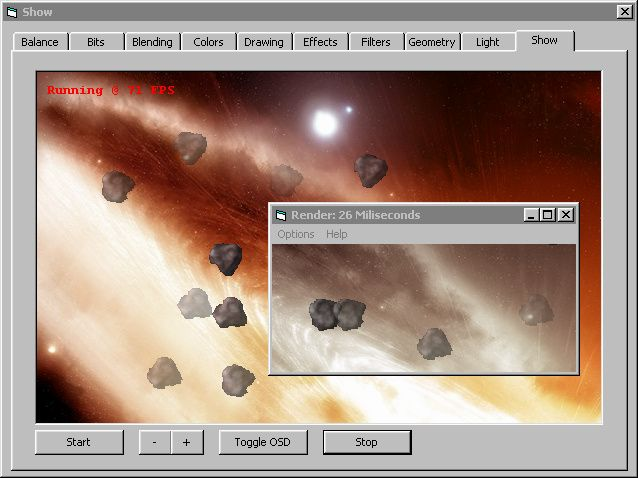



## FX\.DLL 1\.00 SDK

### Description

Experience FX technology!

Features: alpha blending, bit-block transfers, brightness, gamma ramp, hue and saturation correction, RGB, HSL and CMYK calculation, several filters and effects, drawing 2D & 3D objects, taking screen shots etc.
 
### More Info
 

             |
---                |---
**Submitted On**   |2003-04-06 02:59:56
**By**             |[Martins Skujenieks](https://github.com/Planet-Source-Code/PSCIndex/blob/master/ByAuthor/martins-skujenieks.md)
**Level**          |Advanced
**User Rating**    |5.0 (60 globes from 12 users)
**Compatibility**  |VB 4\.0 \(32\-bit\), VB 5\.0, VB 6\.0, VBA MS Access, VBA MS Excel
**Category**       |[Libraries](https://github.com/Planet-Source-Code/PSCIndex/blob/master/ByCategory/libraries__1-49.md)
**World**          |[Visual Basic](https://github.com/Planet-Source-Code/PSCIndex/blob/master/ByWorld/visual-basic.md)
**Archive File**   |[FX\_DLL\_1\_0157077482003\.zip](https://github.com/Planet-Source-Code/martins-skujenieks-fx-dll-1-00-sdk__1-44559/archive/master.zip)

